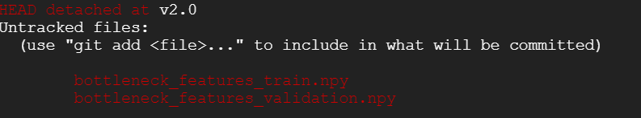
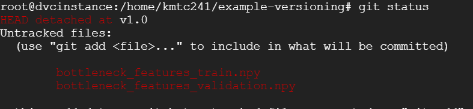
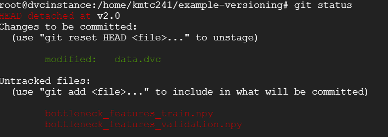

# DVC(Data Version Control) 

<code> Image from https://github.com/iterative/dvc </code>
          
### 머신러닝 데이터 버전 관리를 위한 오픈소스인 DVC를 이용한 튜토리얼 자료입니다.

### Tutorial:Versioning
DVC 명령어를 통해 다양한 버전의 데이터 셋과 ML models을 작업해보았습니다.

Kaggle의 Dogs vs. Cats 데이터를 사용하였으며, 먼저 레이블된 1000개의 이미지를 사용하여 분류 모델을 훈련시키고, 이미지 개수를 2배로 늘려서 다시 훈련시킬 것입니다.

#### Preparation
DVC가 다운로드 되지 않았다면, [여기](https://dvc.org/doc/install)를 참고하시기 바랍니다.  
Windows를 사용 중이라면, [Windows에서 DVC 사용하기](https://dvc.org/doc/user-guide/running-dvc-on-windows)를 참고하시기 바랍니다.
#

1. 코드를 다운 받습니다.

<code> $ git clone https://github.com/iterative/example-versioning.git </code>  
<code> $ cd example-versioning </code>

2. virtual environment를 셋팅합니다.

<code> $ virtualenv -p python3 .env </code>  
<code> $ source .env/bin/activate </code>  
<code> $ pip install -r requirements.txt </code>

3. 첫 번째 모델 구축 : 데이터 load 및 모델 학습

<code> $ dvc get https://github.com/iterative/dataset-registry tutorial/ver/data.zip </code>  
<code> $ unzip -q data.zip </code>  
<code> $ rm -f data.zip </code>  
<code> $ dvc add data </code>  
<code> $ python train.py </code>  

훈련의 결과로 <code> model.h5 </code> 파일과 <code> metrics.csv </code> 파일이 만들어진다.  

<code> $ dvc add model.h5 </code>  

### Directory structrue:

├── train  
│   ├── dogs  
│   │   ├── dog.1.jpg  
│   │   ├── ...  
│   │   └── dog.500.jpg  
│   └── cats  
│       ├── cat.1.jpg  
│       ├── ...  
│       └── cat.500.jpg  
└── validation  
   ├── dogs  
   │   ├── dog.1001.jpg  
   │   ├── ...  
   │   └── dog.1400.jpg  
   └── cats  
       ├── cat.1001.jpg  
       ├── ...  
       └── cat.1400.jpg  
       
 4. 현재 상태 commit 하기  
 
 <code> $ git add .gitignore model.h5.dvc data.dvc metrics.csv</code>  
 <code> $ git commit -m "First model, trained with 1000 images"</code>  
 <code> $ git tag -a "v1.0" -m "model v1.0, 1000 images"</code>  
 
 5. 두 번째 모델 구축 : 1000개 이미지 추가 (500개 고양이, 500개 강아지)
 
 <code> $ dvc get https://github.com/iterative/dataset-registry tutorial/ver/new-labels.zip </code>  
 <code> $ unzip -q new-labels.zip </code>  
 <code> $ rm -f new-labels.zip </code>  
 <code> $ dvc add data </code>  
 <code> $ python train.py </code>  
 <code> $ dvc add model.h5 </code>  
 
 ### Directory structrue:
 
 data  
├── train  
│   ├── dogs  
│   │   ├── dog.1.jpg  
│   │   ├── ...  
│   │   └── dog.1000.jpg  
│   └── cats  
│       ├── cat.1.jpg  
│       ├── ...  
│       └── cat.1000.jpg  
└── validation  
   ├── dogs  
   │   ├── dog.1001.jpg  
   │   ├── ...  
   │   └── dog.1400.jpg  
   └── cats  
       ├── cat.1001.jpg  
       ├── ...  
       └── cat.1400.jpg  
 
 6. 현재 상태 commit 하기
 
 <code> $ git add .gitignore model.h5.dvc data.dvc metrics.csv</code>  
 <code> $ git commit -m "Second model, trained with 2000 images"</code>  
 <code> $ git tag -a "v2.0" -m "model v2.0, 2000 image"</code>  
 
 

<code> dvc checkout </code> 명령어로 <code> git checkout</code> 와 유사한 방식으로 커밋된 버전의 데이터를 얻을 수 있습니다.  
   
<code> Image from https://dvc.org/static/img/versioning.png </code>

버전 load를 위한 두 가지 방법: DVC는 매번 데이터 또는 모델 파일을 복사하지 않도록 이 작업을 최적화해줍니다.

[1] 전체 버전을 바꾸고 싶을 때  
<code> $ git checkout v1.0 </code>  
<code> $ dvc checkout </code>  

[2] 현재 code의 버전은 유지하고 이전의 데이터 셋만 이용하고 싶을 때  
<code> $ git checkout v1.0 data.dvc</code>    
<code> $ dvc checkout data.dvc</code>  

<code> git status</code> 명령어로 변경 확인사항을 확인 가능하다.
